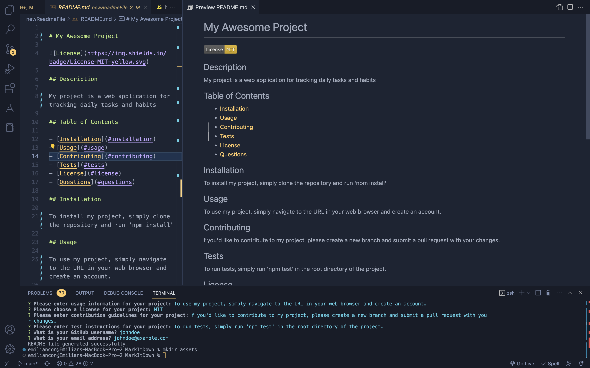
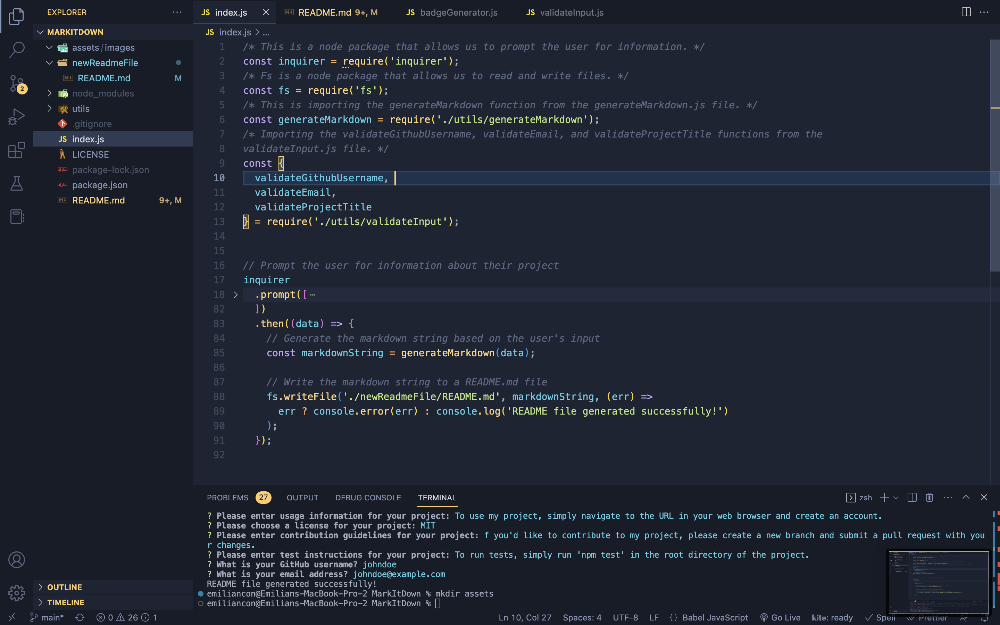

# MarkItDown

<strong>MarkItDown</strong> is a command-line interface tool that allows users to easily generate a professional <strong>README file</strong> for their GitHub projects. With this tool, users can quickly input information about their project, such as the <strong>title</strong>, <strong>description</strong>, <strong>installation instructions</strong>, <strong>usage information</strong>, <strong>license</strong>, <strong>contribution guidelines</strong>, and <strong>test instructions</strong>.

The tool uses <strong>Node.js</strong> packages like <strong>Inquirer</strong> and <strong>fs</strong> to prompt the user for information and write the markdown string to a <strong>README.md</strong> file. It also includes input validation functions to ensure that the user's input is valid, such as validating the user's <strong>GitHub username</strong> and <strong>email address</strong>.

## Project Live Video Demo👇

* Check out the live video demo [@MarkItDown](https://drive.google.com/file/d/1R22T2q9FY4P7ZfJRNlem_Jbo8aS7JdEq/view) and see how it works! 🚀

## Table of Contents

* [Installation](#installation)
* [Usage](#usage)
* [Screenshots](#screenshots)
* [Authors](#authors)
* [Skills](#skills)
* [Stack](#stack)
* [Download](#download)
* [License](#license)

## Screenshots

## Authors

* [@Constantin-E-T](https://github.com/Constantin-E-T/)

## Installation

1. Clone this repository to your local machine.

    <code style="background-color: #2d2d2d; color: white">git clone https://github.com/Constantin-E-T/MarkItDown.git</code>

2. Change Dir.

    <code style="background-color: #2d2d2d; color: white">cd MarkItDown</code>

2. Install the necessary dependencies using npm.

    <code style="background-color: #2d2d2d; color: white"> npm install </code>

## Usage

1. Run the index.js file in your terminal to start the MarkItDown tool.

    <code style="background-color: #2d2d2d; color: white"> node index.js </code>

2. Follow the prompts to input information about your project.

3. Once you have completed all the prompts, the generated README.md file will be saved in the newReadmeFile directory.

## Skills

    Javascript, HTML, CSS, Python, Django

## Stack

    JavaScript, Node.js

## License

[MIT](https://choosealicense.com/licenses/mit/)
